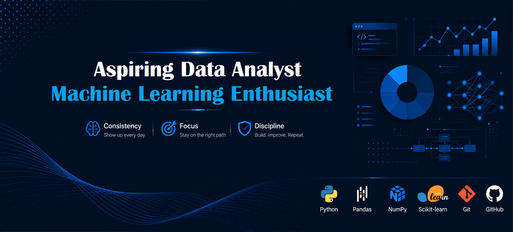

  

# Hi, I'm Mostafa Mousavi 👋

### Aspiring Data Analyst | Machine Learning Enthusiast

I'm a Materials Engineer transitioning into **Data Analysis** and **Machine Learning**.

I enjoy solving real-world problems with Python, building end-to-end projects, and continuously improving my technical skills through disciplined, hands-on learning.

---

## 👨‍💻 About Me

- 🎓 B.Sc. & M.Sc. in Materials Engineering
- 📊 Transitioning into Data Analysis & Machine Learning
- 🐍 Passionate about Python and real-world projects
- 🌱 Currently learning SQL, Power BI, and Deep Learning
- 🚀 Building projects to solve practical problems and strengthen my portfolio

---

## 🎯 How I Work

- ✔ Consistency
- ✔ Focus
- ✔ Discipline

I believe meaningful progress comes from showing up consistently, staying focused, and improving through continuous practice.

---

## 💻 Tech Stack

- Python
- NumPy
- Pandas
- Matplotlib
- Scikit-learn
- Git
- GitHub

---

## 🚀 Featured Projects

### 🧠 Steel Annealing Classification
Machine Learning classification project using the UCI Annealing dataset with data preprocessing, feature engineering, and Random Forest optimization.
🔗 https://github.com/mstf-dev/steel-annealing-classification

### 📈 Superstore Sales Analysis
Exploratory Data Analysis project focused on extracting business insights from retail sales data using Python, Pandas, and Matplotlib.
🔗 https://github.com/mstf-dev/Superstore-Sales-Analysis

### 🔐 Password Manager
A command-line password manager built with Python using modular programming and file handling.
🔗 https://github.com/mstf-dev/password-manager

---

## 📚 Currently Learning

- SQL
- Power BI
- Deep Learning

---

## 📫 Connect with Me

- LinkedIn: https://linkedin.com/in/mstf-dev
- Email: mostafa.mousavi.dev@gmail.com
